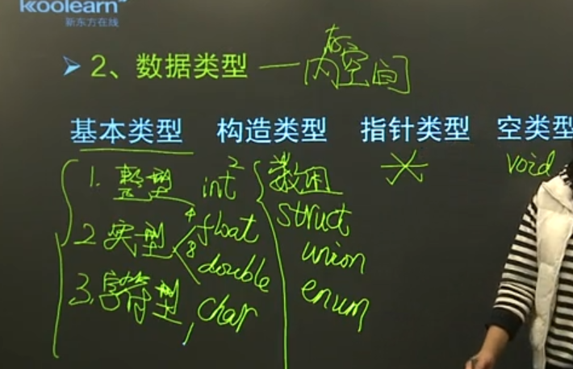
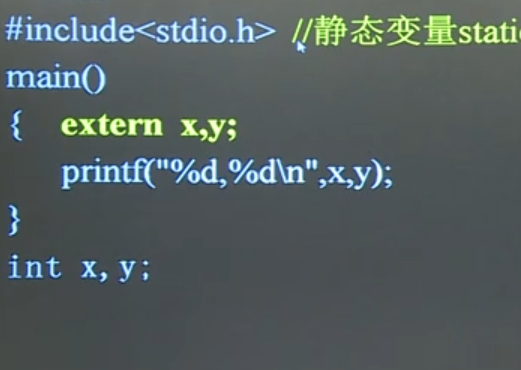

## C语言组成
- 注释
- 定义语句
- 执行语句

## 数据与数据类型
### 数据：
常量、变量、表达式、函数

### 数据类型：
基本类型、构造类型、指针类型、空类型  

用户自定义标识符：第一个字符必须是字母或下划线

#### 常量
- 整型常量  
   - 十进制
   - 八进制:0 
   - 十六进制：0x

    (长整型后面加L，0L，34L、0x7L)

- 实型常量
  - 小数：123.
  - 指数:1.23E-5(1.字母E/e前后必须有数字，后必须是整数  2.字母E/e前后及数字之间不能有空格)

- 字符型常量
  - 一对单引号：‘a’   '@'
  - 转义字符常量：'\n'  ' \t'  ' \r'(回车)  ' \b'(退格)   ' \\'

- 字符串常量
  - 以‘\0’结束  
  - C语言中没有字符串变量

#### 变量（存常量）
先定义后使用

没定义初值为随机值

变量三属性
  - 类型：定义
  - 作用范围：局部、全局

        所有形参都是局部变量
        同一文件中若局部变量与全局变量重名，局部变量屏蔽全局变量
  - 存储类别：

        auto（可以省略)：
            用完后释放存储空间
            局部变量默认为auto，无初始化，初值为随机值
            临时变量都是auto
        static（静态变量，必须声明)：
            从定义到程序结束都占用存储空间
            全局变量默认为static，无初始化，初值为0
            只能执行一次初始化
        register：
            只能是局部变量（寄存器）
        extern：
            可以加大变量作用范围

#### 表达式
- 求余：两边都是整形、符号与被除数保持一致
- 赋值表达式：从右向左运算，运算后的值就是表达式的值（=左边必须是变量名）
- 逗号表达式：从左向右求值，表达式值为最后一个的值
- 强制转换：
