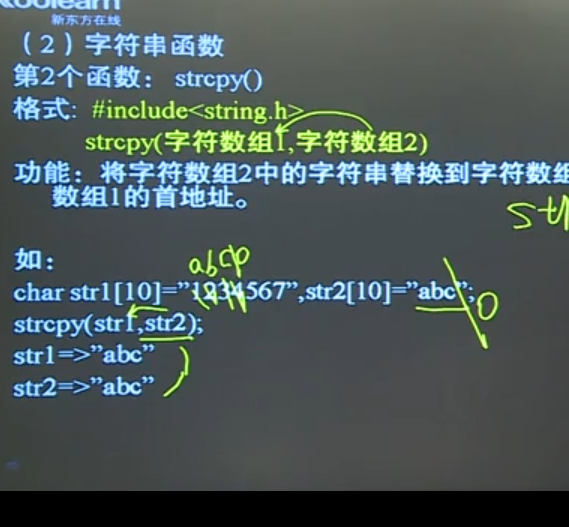
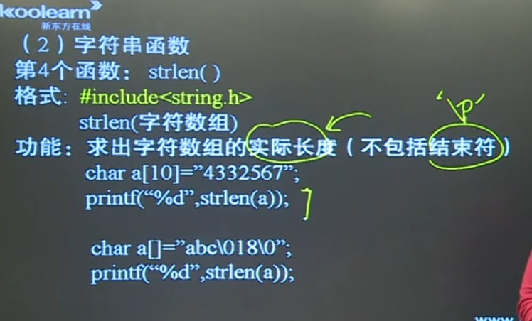

## 写在前面
**先定义后使用,定义不能有变量**

**数组名为地址常量，不能放在赋值语句左边**

## 一维数组
初始化 

`类型名 数组名[常量表达式] = {    ，  ，   ，}` 少定义的自动补零,初值不给则为随机值）

```c
int a[]={1,3,4};//（初值给了数组长度可以省略）
```

## 二维数组
定义

`类型名  数组名 [常量表达式1][常量表达式2]`（【行】【列】）
初始化
```c
int a[2][3]={1,2,3,4,5,6};
int a[2][3]={{1,2,3},{4,5,6}};
int a[][3]={1,2,3,4,5,6};//（初值给了可以省略行数）
```

## 字符串
c语言没有字符串变量

字符数组存放字符串要有一个元素存放‘\0’   

"" = "\0"

```c
char a[]="abcd";       //长度 = 5
char a[]={'a','b','c','d'}; //长度 = 4 （单引号无'\0'）是字符数组，不是字符串
char a[]={"abcd"};     //长度 = 5
const char *x = "abc";   //x指向的字符串被当作静态常量，不可修改
```

### 字符串存储
char a[10];

1. scanf("%s",a); (空格或回车都结束)
2. #include<stdio.h> gets(a); (只有回车才结束) puts(a) ('\0'转换成‘\n')
3. 字符数组
4. strcpy(a,"kljafha;fk");




