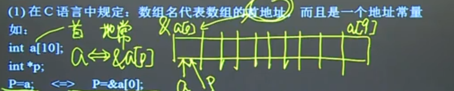
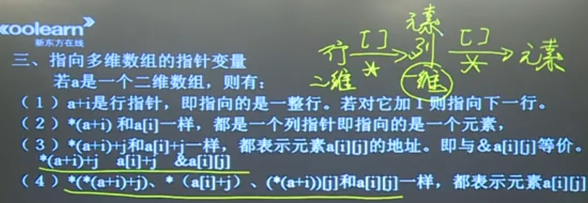
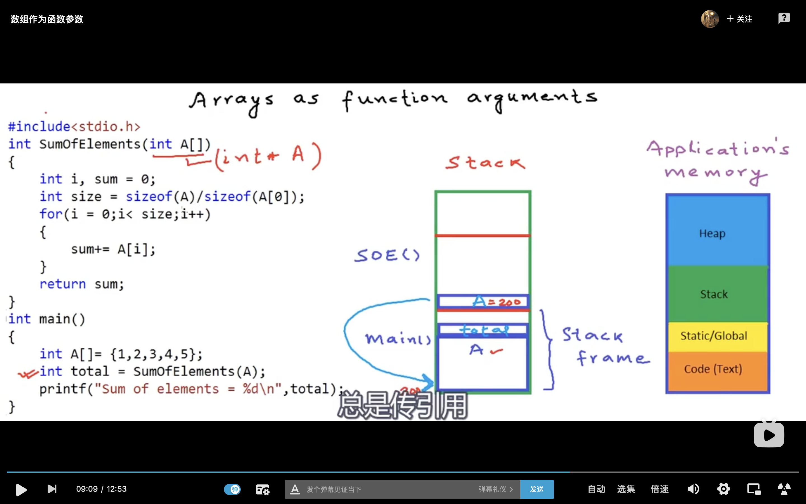
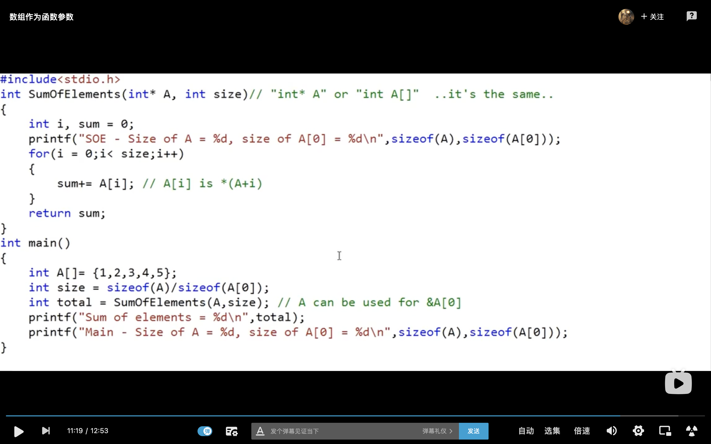

## 01指针变量
地址变量=指针变量（存放地址值）

内容值只能放在内容变量里

指针在内存中分配的字节数相同 （2字节）

指针变量要定义并初始化 

```c
int *temp ;
*temp = 10  //(错)
```

## 02指向数组元素的指针变量



*p++ = *(p++)     (单目同级别由右向左运算)

## 03指向多维数组的指针变量



### 列指针变量
```c
int a[2][3]={1,2,3,4,5,6}

int *p//(列指针变量=元素指针变量)

p=a[0]  //(p=a是错的,a是行指针，p是列指针）

cout<<*(p+5) //输出6      
```

### 行指针变量
```c
int a[5][7]
int (*p)[7] //(行指针变量)
p=a

```

`int  w[3][4]`

`w`:
1. 元素首地址
2. 地址常量，不能修改
3. 行指针，w+1向下移一行

## 04指向字符串的指针变量
按首地址处理符串常量   “abc”=首个字符地址常量

```c
char str[]="abc";
char str[]={"abc"};

char *p="abc";
char *p={"abc"};  //(×)
```

## 05指向函数的指针变量
函数名与数组名一样，是起始地址，是地址常量

`类型名   （*指针变量名）（）` 
```c
int fun()
{

}

int (*p)();
p = fun;
```

## 06返回指针的函数(返回地址)
```c
int *fun (int *x,int *y)
{
    return x;
}
```

## 07常量指针(可以换值，不能换地址)
```c
int x =100;
int * const p = &x;
*p = 200; 
```

## 08指针常量(可以换地址，不能改值)
```c
int x = 100;
int y = 200;
const int * p =&x;
p = &y;
```

## 09数组作为函数参数
call by value 传值调用

call by reference 传引用 （&a，节省内存）(*p 解引用)

当编译器看到数组作为参数的时候，不会拷贝整个数组，而是创建一个指向数组首元素的指针，所以数组作为参数总是传引用不会传值

int A[] = int *A    ([]表示这是一个数组)还需要传入数组长度，如图2，但是字符数组不用，字符数组到‘\0’结束


