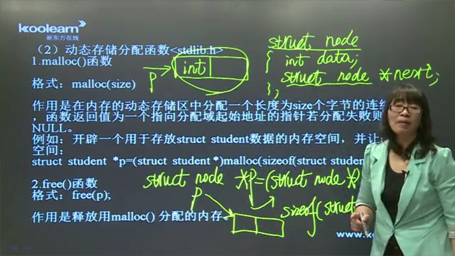

## 结构体
```c
struct student//(结构体类型名) 
{
    char str[10];
}a,b,c[10];//(变量名)
```

初始化
```c
a.str = "jlsasjfajg";//×
strcpy(a.str,"jlsasjfajg");
struct student b = {"jlsasjfajg"};
```

引用成员变量
`->`一级运算符 


## 动态存储分配函数
`malloc(size)`

在内存的动态存储区中分配一个长度为size个字节的连续空间，函数返回值为一个指向分配域起始地址的指针，分配失败返回NULL



## 共用体类型


## typedef 
定义新的类型名来代替已有的类型名 ，不能定义变量
```c
typedef int INTEGER;
```