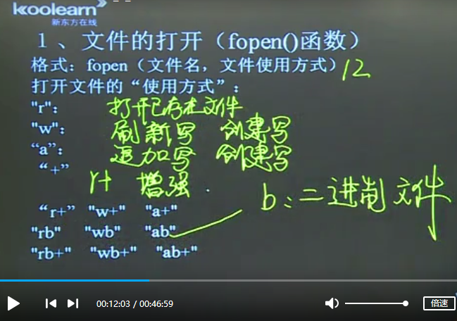
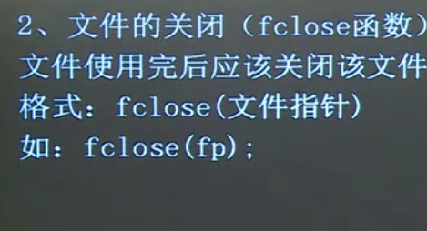
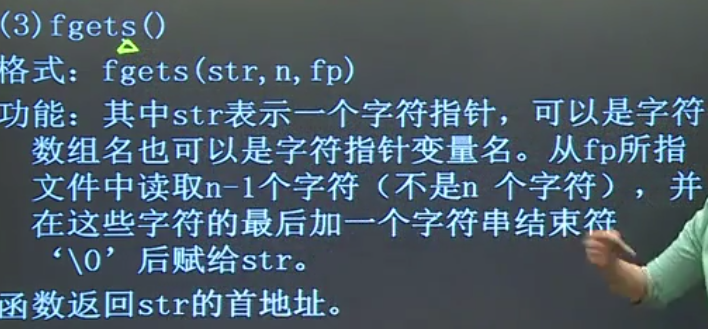
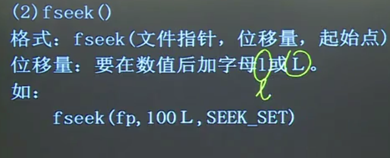
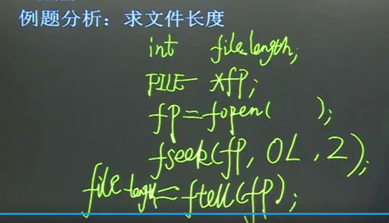
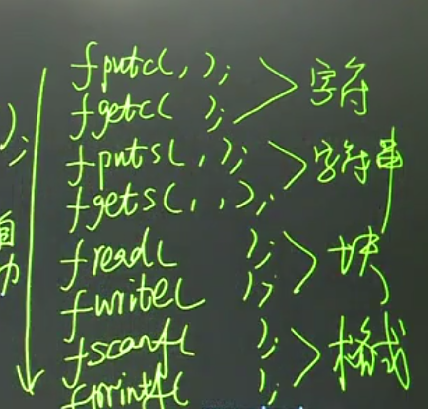

## 位运算

位运算的操作对象只能是整形或字符型

### & 按位与 
全1为1 ，有0为0  （清零）

### | 按位或
全1为1，全0为0 

### ^ 按位异或
相异为1，相同为0

### ~ 按位取反（单目运算符）
~24

### 《 按位左移
将二进制位按位左移n位

5<<2 (5左移两位=5 * 2^2)

### 》按位右移

## 文件

### 文件分类
1. 文本文件
2. 二进制文件

c语言按字符（字节）存储文件

### 文件类型指针
FILE 就是文件类型，是一个结构体类型

FILE *fp;

### 打开文件

### 关闭文件

### fputc

### fgetc

### fputs

### fgets

### fread fwrite

### fprintf fscanf

### feof

### rewind

### fseek

### ftell

### fflush

### 总结
