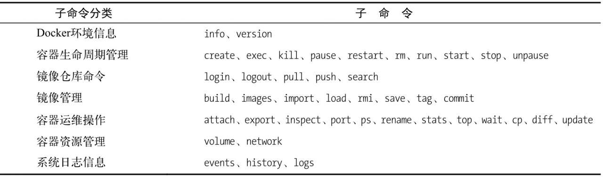
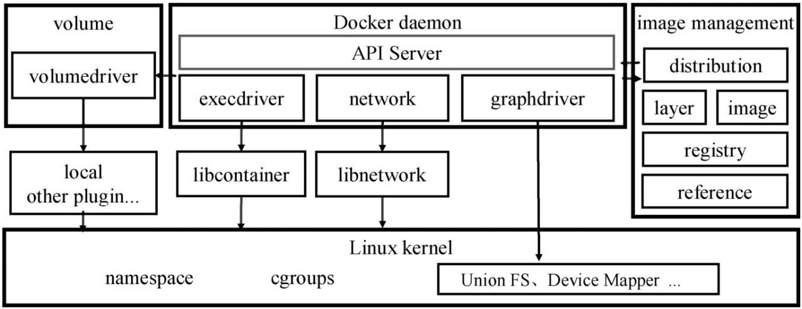

## 定义
根据官方的定义，Docker是以Docker容器为资源分割和调度的基本单位，封装整个软件运行时环境，为开发者和系统管理员设计的，用于构建、发布和运行分布式应用的平台。它是一个跨平台、可移植并且简单易用的容器解决方案

## docker命令

Docker的设计理念是希望用户能够保证一个容器只运行一个进程，即只提供一种服务。然而，对于用户而言，单一容器是无法满足需求的。通常用户需要利用多个容器，分别提供不同的服务，并在不同容器间互连通信，最后形成一个Docker集群。Docker基于轻量级虚拟化技术，其易用、跨平台、可移植的特性使其在集群系统的搭建方面有着得天独厚的优势,因此Docker可以实现分布式应用集群的快速、准确、自动化部署

## docker架构

### docker daemon
是一个`API Server`,负责接收由`Docker client`发送的请求,同一分发调度

### docker client
任何遵循了`Docker API`的客户端都可以被称为docker client

### image management
`distribution`、`registry`、`layer`、`image`、`reference`等模块实现了Docker镜像的管理

1. `distribution`负责与`Docker registry`交互，上传下载镜像以及存储与`v2 registry`有关的元数据。
2. `registry`模块负责与`Docker registry`有关的身份验证、镜像查找、镜像验证以及管理`registry mirror`等交互操作。
3. `image`模块负责与镜像元数据有关的存储、查找，镜像层的索引、查找以及镜像tar包有关的导入、导出等操作。
4. `reference`负责存储本地所有镜像的`repository`和`tag`名，并维护与镜像ID之间的映射关系。
5. `layer`模块负责与镜像层和容器层元数据有关的增删查改，并负责将镜像层的增删查改操作映射到实际存储镜像层文件系统的`graphdriver`模块

### dirver
`docker daemon`将收到的请求转译成统一的操作接口,`Docker`把这些操作分成了容器执行驱动、`volume`存储驱动、镜像存储驱动3种，分别对应`execdriver`、`volumedriver`和`graphdriver`

1. `execdriver`是对Linux操作系统的`namespaces`、`cgroups`、`apparmor`、`SELinux`等容器运行所需的系统操作进行的一层二次封装,目前默认实现是基于`libcontainer`
2. `volumedriver`是volume数据卷存储操作的最终执行者，负责volume的增删改查,docker默认策略是将卷都存在本地的Docker根目录下的`volumes`
3. `graphdriver`是所有与容器镜像相关操作的最终执行者。`graphdriver`会在`Docker`工作目录下维护一组与镜像层对应的目录，并记下镜像层之间的关系以及与具体的`graphdriver`实现相关的元数据,这样，用户对镜像的操作最终会被映射成对这些目录文件以及元数据的增删改查，从而屏蔽掉不同文件存储实现对于上层调用者的影响,在Linux环境下，目前Docker已经支持的graphdriver包括aufs、btrfs、zfs、devicemapper、overlay和vfs

### network
在Docker 1.9版本以前，网络是通过`networkdriver`模块以及`libcontainer`库完成的，现在这部分功能已经分离成一个`libnetwork`库独立维护了,`libnetwork`抽象出了容器网络模型(Container Network Model, CNM), CNM提供了沙盒、端点、网络这三种对象