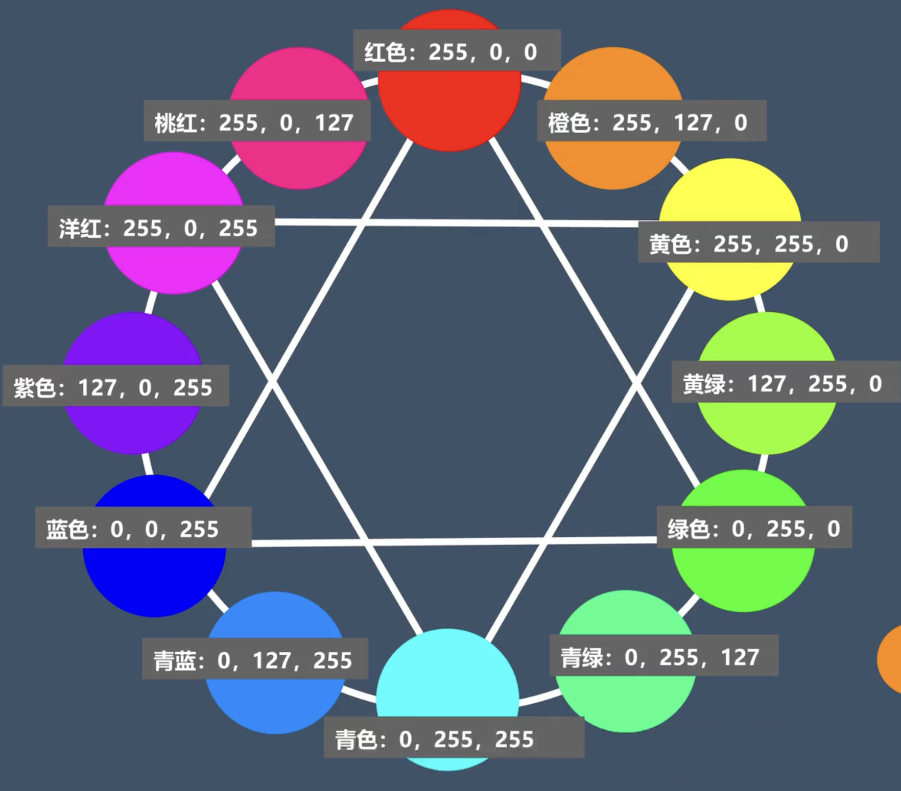
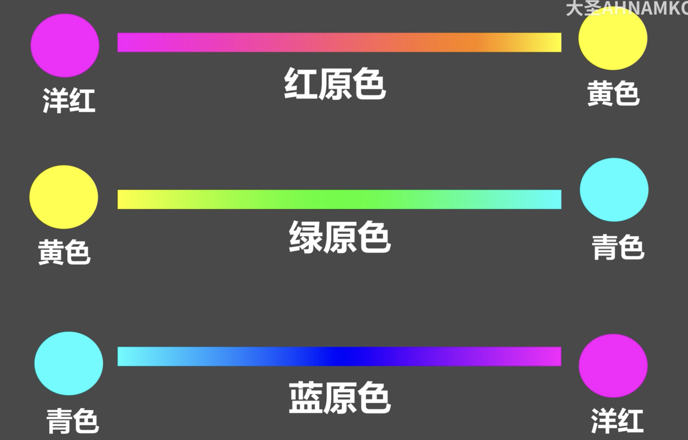

## 01 基础设置

### 修改照片模式下隐藏
- 上 **f5** 
- 下 **f6**
- 左 **f7**
- 右 **f8**
- 隐藏左右 **tab**
- 隐藏全部 **shift+tab**
- 旗标 **p**
- 移去旗标 **u**
- 设置为排除 **x**

## 02 镜头矫正
### 畸变
- 广角容易产生筒形畸变
- 长焦容易产生枕形畸变
### 色差
- 良好光照条件下逆光时暗部物体边缘 
- 对比度高时暗部物体边缘
- 大光圈拍照时暗部物体边缘
- 和相机镜头成像质量有关
### 暗角
- 焦距短 光圈大 光照不好

## 03 色彩

- 45度 邻近色
- 120度 对比色
- 180度 互补色

- hsl调色顺序 色相->亮度->饱和度

- 提高鲜艳度降低饱和度达到颜色统一
- 色温色调适合调整夜景照片，对黑色不起作用

## 04 影调
- 原片是否曝光准确？亮的部分是哪里？暗的部分是哪里？亮的部分该亮吗？暗的部分该暗吗？
- 确定自己想要的风格整体影调该如何变化？亮的部分应该多亮？暗的部分应该多暗？

## 05清晰度 
通过提高各部分边缘的**色相**和**亮度**的差别从而让图片更清楚
- 用于增强照片质感(增加粗糙感或沧桑感)

## 06锐化
通过勾边让图片更清楚
- 用于增强物体轮廓

## 07噪点

- 热噪点: 相机长时间曝光 处理信息过多 相机CMOS过热（无法处理）
- 亮度噪点: 黑白颗粒
- 颜色噪点: 彩色颗粒

一般先除去眼色噪点再去除亮度噪点

## 08校准

### 红绿蓝三原色向任意方向偏移时
1. 原色及邻近色，偏向目标颜色
2. 滑杆另一侧颜色，饱和度降低
3. 原色和目标颜色的互补色区域，色相相互靠拢

**目的是可以统一照片色相,搭配hsl达到简化视觉要素**

## 09分离色调
以亮度划分的**整体**调色工具
**多用于光比大的场景**

## 
### 颜色划分
- HSL:某一具体色相
- 校准:局部色相偏移

### 亮度划分
- 分离色调:局部亮度（高光、阴影、中间调）
- 曲线调色:自定义亮度
- 色温色调: 也会影响亮度