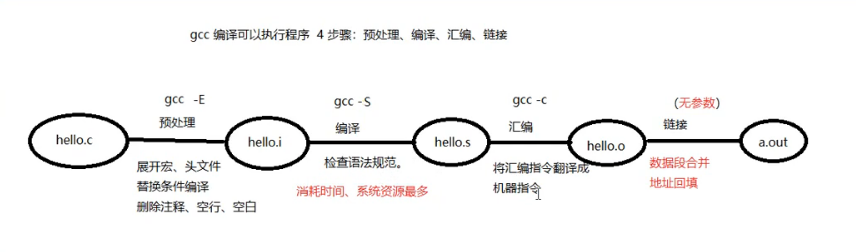
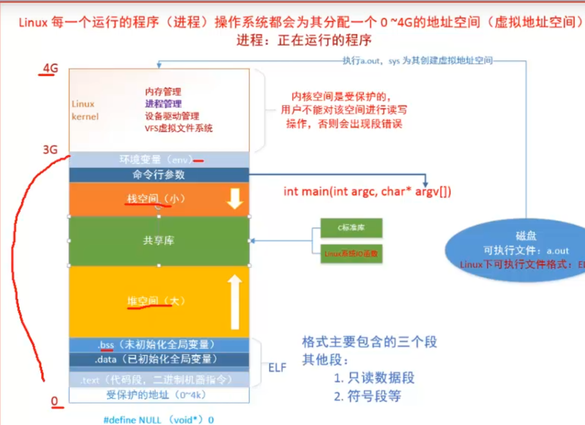
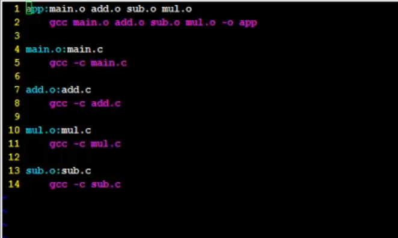

gcc编译：

	4步骤： 预处理、编译、汇编、连接。

	-I：	指定头文件所在目录位置。

	-c：	只做预处理、编译、汇编。得到 二进制 文件！！！

	-g：	编译时添加调试语句。 主要支持 gdb 调试。

	-Wall： 显示所有警告信息。

	-D：	向程序中“动态”注册宏定义。   #define NAME VALUE

生成静态库： 

        ar  rcs libtest.a test.o 

        nm libtest.a   查看信息

生成动态库：

   (生成与位置无关的代码 -fPIC） 使用 gcc -shared 制作动态库

    gcc -fPIC -c test.c  -o test.o   	
    gcc  -shared -o libtest.so test.o 

解决动态库无法加载的问题：

- 放到lib目录中
- 临时 export LD_LIBRARY_PATH = 动态库路径
- 永久  .bashrc 添加 2(动态库路径要用绝对路径)   更新： source .bashrc
- /etc/ld.so.conf 添加动态库路径   更新：sudo  ldconfig

运行可以执行程序 ./a.out 出错！！！！ --- ldd a.out --> "not found"

	error while loading shared libraries: libxxx.so: cannot open shared object file: No such file or directory

	原因：
		链接器：	工作于链接阶段， 工作时需要 -l 和 -L

		动态链接器：	工作于程序运行阶段，工作时需要提供动态库所在目录位置。

	解决方式：				

		【1】 通过环境变量：  export LD_LIBRARY_PATH=动态库路径

			./a.out 成功！！！  （临时生效， 终端重启环境变量失效）

		【2】 永久生效： 写入 终端配置文件。  .bashrc  建议使用绝对路径。

			1) vi ~/.bashrc

			2) 写入 export LD_LIBRARY_PATH=动态库路径  保存

			3）. .bashrc/  source .bashrc / 重启 终端  ---> 让修改后的.bashrc生效

			4）./a.out 成功！！！ 

		【3】 拷贝自定义动态库 到 /lib (标准C库所在目录位置)

		【4】 配置文件法

			1）sudo vi /etc/ld.so.conf

			2) 写入 动态库绝对路径  保存

			3）sudo ldconfig -v  使配置文件生效。

			4）./a.out 成功！！！--- 使用 ldd  a.out 查看

gdb

基础指令：
	-g：使用该参数编译可以执行文件，得到调试表。

	gdb ./a.out

	list： list 1  列出源码。根据源码指定 行号设置断点。

	b：	b 20	在20行位置设置断点。

	run/r:	运行程序

	n/next: 下一条指令（会越过函数）

	s/step: 下一条指令（会进入函数）

	p/print：p i  查看变量的值。

	continue：继续执行断点后续指令。

	finish：结束当前函数调用。 

	quit：退出gdb当前调试。

其他指令：

	run：使用run查找段错误出现位置。

	set args： 设置main函数命令行参数 （在 start、run 之前）

	run 字串1 字串2 ...: 设置main函数命令行参数

	info b: 查看断点信息表

	b 20 if i = 5：	设置条件断点。

	ptype：查看变量类型。

	bt：列出当前程序正存活着的栈帧。

	frame： 根据栈帧编号，切换栈帧。

	display：设置跟踪变量

	undisplay：取消设置跟踪变量。 使用跟踪变量的编号。

Makefile

	命名：makefile	 Makefile  --- make 命令

	1 个规则：

		目标：依赖条件
		（一个tab缩进）命令

		1. 目标的时间必须晚于依赖条件的时间，否则，更新目标

		2. 依赖条件如果不存在，找寻新的规则去产生依赖条件。

	ALL：指定 makefile 的终极目标。

	2 个函数：

		src = $(wildcard ./*.c): 匹配当前工作目录下的所有.c 文件。将文件名组成列表，赋值给变量 src。  src = add.c sub.c div1.c 

		obj = $(patsubst %.c, %.o, $(src)): 将参数3中，包含参数1的部分，替换为参数2。 obj = add.o sub.o div1.o

	clean:	(没有依赖)

		-rm -rf $(obj) a.out	“-”：作用是，删除不存在文件时，不报错。顺序执行结束。

	3 个自动变量：

		$@: 在规则的命令中，表示规则中的目标。

		$^: 在规则的命令中，表示所有依赖条件。

		$<: 在规则的命令中，表示第一个依赖条件。如果将该变量应用在模式规则中，它可将依赖条件列表中的依赖依次取出，套用模式规则。

	模式规则：

		%.o:%.c
		   gcc -c $< -o %@

	静态模式规则：

		$(obj):%.o:%.c
		   gcc -c $< -o %@	

	伪目标：

		.PHONY: clean ALL

	参数：
		-n：模拟执行make、make clean 命令。

		-f：指定文件执行 make 命令。				xxxx.mk

