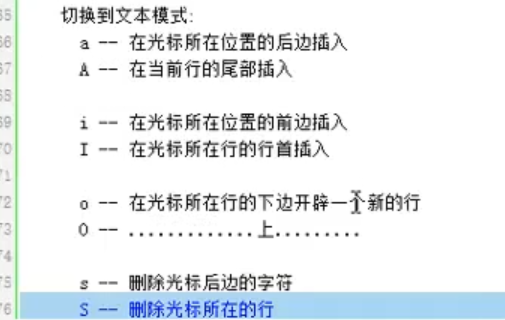
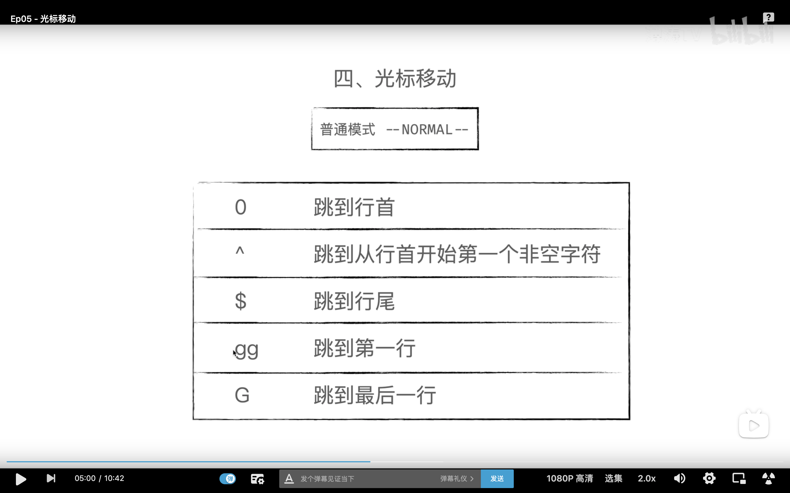
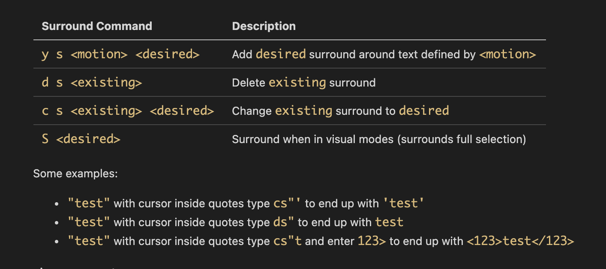

跳转到指定行：

	1. 88G （命令模式）

	2. :88  (末行模式)

跳转文件首：

	gg （命令模式）

跳转文件尾：

	G（命令模式）

自动格式化程序：

	gg=G（命令模式）

大括号对应：

	% （命令模式）

光标移至行首：

	0 （命令模式）执行结束，工作模式不变。

光标移至行尾：

	$ （命令模式）执行结束，工作模式不变。

删除 = 剪切

删除单个字符：

	x （命令模式）执行结束，工作模式不变。

替换单个字符：

	将待替换的字符用光标选中， r （命令模式），再按欲替换的字符

删除一个单词：

	dw（命令模式）光标置于单词的首字母进行操作。

删除光标至行尾：

	D 或者 d$（命令模式）

删除光标至行首：

	d0 （命令模式）

删除指定区域：

	按 V  v （命令模式）切换为 “可视模式”，使用 hjkl挪移光标来选中待删除区域。  按 d 删除该区域数据。y复制

删除指定1行：

	在光标所在行，按 dd （命令模式）

删除指定N行：

	在光标所待删除首行，按 Ndd （命令模式）

复制一行：

	yy

粘贴：
	p：向后、P：向前。

查找：
	1. 找 设想 内容：

		命令模式下， 按 “/” 输入欲搜索关键字，回车。使用 n N 检索下一个。

	2. 找 看到的内容：

		命令模式下，将光标置于单词任意一个字符上，按 “*”/ “#” 

单行替换：

	将光标置于待替换行上， 进入末行模式，输入 :s /原数据/新数据

通篇替换：

	末行模式， :%s /原数据/新数据/g   g:不加，只替换每行首个。   sed 

指定行的替换：

	末行模式， :起始行号，终止行号s /原数据/新数据/g   g:不加，只替换每行首个。

		:29,35s /printf/println/g

撤销:   u

反撤销：ctrl+r（命令模式）

分屏：
	sp：横屏分。 Ctrl+ww 切换。

	vsp：竖屏分。Ctrl+ww 切换。

跳转至 man 手册：

	将光标置于待查看函数单词上，使用 K（命令模式）跳转。 指定卷， nK

查看宏定义：

	将光标置于待查看宏定义单词上，使用 [d 查看定义语句。

在末行模式执行shell命令：

	:!命令		:! ls -l 

